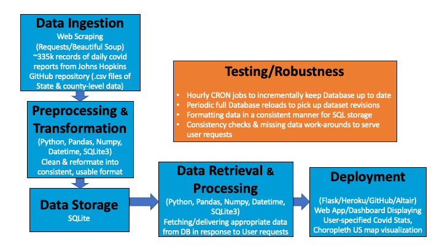
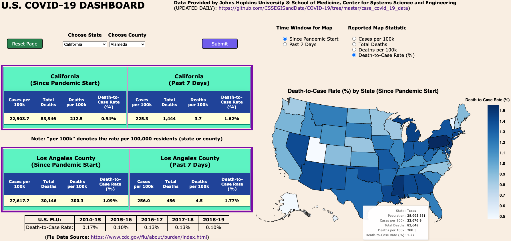

# DATA ENGINEERING PROJECT WRITE-UP

### A USER-CONFIGURABLE WEB-BASED COVID-19 CASE AND DEATH RATE DASHBOARD FOR THE U.S. 

## Abstract

Since the early days of the COVID-19 pandemic, Johns Hopkins Center for Systems Science and Engineering (CSSE) has offered the public a free dashboard of cases and deaths (see https://coronavirus.jhu.edu/map.html). Updated daily, this dashboard has included more and more information on the pandemic worldwide over time. This evolving over-complexity trend is reflected in virtually every COVID-19 dashboard currently available to the general public. As a result, getting basic, easily digestible pandemic information for a specific U.S. location has become fairly overwhelming for the average person.

The intent of this project is to provide an alternative web-based dashboard where someone can get just the most basic, useful information for a given U.S. state and major county without being flooded with excessive data and visualizations of little or no practical use.

## Design

The Data Pipeline for this project appears below:

Hourly CRON jobs (currently running locally on a 24/7 operational Macintosh) check for the daily COVID data updates on the Johns Hopkins GitHub repository and incrementally update the SQLite database with any new data. Also, a separate CRON job periodically (currently every 3 days) deletes the entire SQLite database and re-ingests everything to capture any after-the-fact corrections Johns Hopkins may have made to older data. A third CRON job pushes every database update to GitHub (https://github.com/georgepappy/tracker1) where Heroku can detect the changes and immediately deploy the latest version for use in the Flask dashboard application (which can be found at https://covid-tracker-22.herokuapp.com/).

## Data

The dataset for this project comes from the Johns Hopkins CSSE COVID-19 data repository (https://github.com/CSSEGISandData/COVID-19/tree/master/csse_covid_19_data), which has been augmented with new .csv files documenting the state-level (including Washington, DC) and county-level cumulative COVID case data for the United States on a daily basis since 12 April 2020. (Earlier subsets of data were also provided, but the project only makes use of the data from 12 April 2020 onwards, since that marks the beginning of a complete daily national snapshot of COVID data).

As stored in the SQLite database for use in the web application, an individual unit of state-level data has the following characteristics:

- Province_State (TEXT)          :  Name of US State or 'District of Columbia'
- Confirmed (INTEGER)           :  Cumulative (since start of pandemic) number of active COVID-19 cases for this state and date
- Deaths (INTEGER)                :  Cumulative number of COVID-19 deaths for this state and date
- Incident_Rate (REAL)            :  Cumulative number of COVID-19 cases per 100,000 residents for this state and date
- Case_Fatality_Ratio (REAL)  :  Cumulative rate (%) of COVID-19 deaths for this state and date (same as Death-to Case Rate)
- Date (DATE)                          :  Date covered by this data (format 'yyyy-mm-dd')

And an individual unit of county-level data has the following characteristics:

- Admin2 (TEXT)                      : Name of US county
- Province_State (TEXT)          :  Name of US State or 'District of Columbia'
- Confirmed (INTEGER)           :  Cumulative (since start of pandemic) number of active COVID-19 cases for this county and date
- Deaths (INTEGER)                :  Cumulative number of COVID-19 deaths for this county and date
- Incident_Rate (REAL)            :  Cumulative number of COVID-19 cases per 100,000 residents for this county and date
- Case_Fatality_Ratio (REAL)  :  Cumulative rate (%) of COVID-19 deaths for this county and date (same as Death-to Case Rate)
- Date (DATE)                          :  Date covered by this data (format 'yyyy-mm-dd')

## Algorithms

The deployed dashboard's web-based user interface has the following appearance:

The Flask web application responds to user selections (state and county of interest) by fetching the appropriate data from the SQLite database, performing the necessary "Past 7 Days" Cases per 100,000 People and Deaths per 100,000 People calculations, running error checks and data validation, generating the requested choropleth map, and finally displaying the requested results in the dashboard.

## Tools 

The following tools were used in this project:

1. Pandas, Numpy and Datetime to explore, clean, transform, load, query and quality check data used by the web application
2. Requests and Beautiful Soup to scrape the Hopkins CSSE data repositories and access the datasets
3. SQLite to store the full user-ready dataset serving the web application
4. Python 3.8 (to be able to use all of the above)
5. CRON jobs (run on a local Macintosh) to gather data from the Hopkins CSSE repository, update the SQLite database, and push the latest database version to GitHub (where it can be accessed by Heroku to serve the web application)
6. Altair to generate interactive choropleth maps
7. GitHub to handle the data and code base interface with Heroku
8. Flask/Heroku to implement and host the web application

## Communication

In addtition to presenting final Project Slides to the stakeholders, all work (including the slides) can be found on GitHub: https://github.com/georgepappy/DataEngineering/tree/main/FINAL_PROJECT

